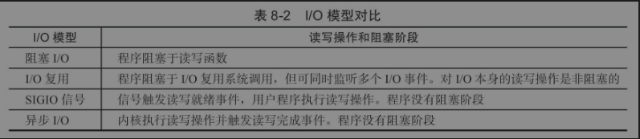

### learnServer


#### process：

```
1.simple webserver
2.libevent   libevent-httpserver
3.others webserver 
4.own webserver
```

### 1.基础知识

#### 分层模型：

```
+ 应用层		 特定协议实现特定功能
+ 运输层		 解决进程之间基于网络的通信问题 重传机制 有序
+ 网络层         解决分组在多个网络上传输的问题  
+ 数据链路层     解决分组在一个网络上传输的问题，比如从一个硬件地址传到另一个硬件地址
+ 物理层  		 何种信号传输比特
```

#### linux网络有关命令

```
host :查询DNS 域名获取ip
route: 查看路由表
etc/services  这个文件是知名服务端口号定义文件
tcpdump 抓包工具 : sudo tcpdump -i lo port 9999  检测回环地址  端口 9999 的tcp数据
nc   可以测试服务器  
telnet 测试

用 strace 查看系统调用
```

#### 传输层协议

tcp 连接状态图:

虚线表示服务器 ，实现表示客户端


注解:TIME_WAIT : 客户端等待服务器重新发送FIN报文的时间，防止服务器没有收到最后一个ACK而重向客户端发消息时客户端可以收到，保证正常结束这个TCP连接。  一般为2MSL  所以这段时间，端口是被占用着的。

+ 1.复位报文段  一般表示关闭连接，或者重新建立连接，异常情况。

#### http 响应消息


#### 网络编程API
+ 1.大小端判断

+ 关于listen函数 ： 此函数监听客户端的连接，完成三次握手，连接成功进入established状态，参数backlog 用来设置监听队列最大长度 比如设置5 则成功连接的个数为6个(backlog+1) 其他连接则不会成功

+ close(fd) 并不是直接关闭fd 而是引用计数-1  shutdown可直接关闭fd

+ tcp数据读写API

  ```
  #include <sys/types.h?
  #include <sys/socket.h>
  ssize_t recv(int sockfd,void *buf,size_t len,int flags);
  ：>0 成功读取多少个字节
  : 返回0  表示对方关闭连接 ！！！ 
  :返回-1  出错并设置errno
  ssize_t send(int sockfd,const void *buf,size_t len,int flags);
  返回>0  表示成功发送的字节个数
  -1 ： 发送失败并设置errno
  ```

+ udf读写API

  ```
  recvfrom sendto
  ```

+ 通用数据读写API

  ```
  recvmsg  分散读  sengmsg 集中写    msghdr 是发送数据的结构 里面包含内存分散的数据
  
  ssize_t readv(int fd,const struct iovec*vector,int count);
  ssize_t writev(int fd,const struct iovec*vector,int count);
  ```

+ 地址API  选项API

  ```
  getsockname getpeername  getsockopt setsockopt
  ```


+ 设置为非阻塞

  ```C++
  int setnonblocking(int fd)
  {
  	int old_option=fcntl(fd,F_GETFL);/*获取文件描述符旧的状态标志*/
      int new_option=old_option|O_NONBLOCK;/*设置非阻塞标志*/
      fcntl(fd,F_SETFL,new_option);
      return old_option;/*返回文件描述符	旧的状态标志，以便*//*日后恢复该状态标志*/
  }
  ```

常用linux API

```
fork()

dup2()
pipe()

```


#### 阻塞，非阻塞 同步 异步

```
数据准备:根据系统IO操作就绪状态：
	阻塞			程序阻塞于读之前的状态。		
	非阻塞			程序不断的检测可读
数据读写：根据程序和内核的交互方式:
	同步			阻塞和非阻塞都是同步   同步指数据可读时程序是处于同步来读的状态  而异步是直接数据读好通知你来接收
	异步			只有调用了特殊api才是异步
	
总结：网络IO接口调用， 分为两个阶段，即 数据准备阶段和数据读写阶段。 数据准备分为 阻塞和非阻塞阶段。阻塞表示阻塞当前线程，而非阻塞就是立马返回，不断轮询。
	同步即 A向B请求调用一个网络IO接口时,数据读写都是由A来完成的。 而异步则是向B传入请求的事件和事件发生的通知方式，当B监听到事件到来时，通知A处理结果。
```


#### 五种IO模型


io复用


#### 服务器一般框架

+ 框架如下：


+ io模型

  

+ 事件处理模式
  + 1.Reactor
  + 2.Proactor
  
+ 有限状态机

#### IO多路复用

```c++
1. select   内存检测描述符有事件到来  有数量限制   轮询判断哪个描述符有什么事件
    #include＜sys/select.h＞
    int select(int nfds,fd_set*readfds,fd_set*writefds,fd_set*exceptfds,struct timeval*timeout);
	FD_ZERO(fd_set*fdset);/*清除fdset的所有位*/
	FD_SET(int fd,fd_set*fdset);/*设置fdset的位fd*/
	FD_CLR(int fd,fd_set*fdset);/*清除fdset的位fd*/
	int FD_ISSET(int fd,fd_set*fdset);/*测试fdset的位fd是否被设置*/

2.epoll  内核中维护一张事件表     事件回调
    
    #include＜sys/epoll.h＞
    int epoll_create(int size)
    LT: 电平触发  ET:边沿触发
       
    非阻塞函数读完之后 错误码是EAGIN 或者 EWOULDBLOCK
    EPOLLONESHOT  表示该描述符同时只能一个线程处理之

```


#### 信号

```c++
1. SIGHUP 进程挂起
2. SIGPIPE 读端关闭 socket连接关闭 此时写数据会触发这个信号并结束进程  
    客户端关闭socket，POLLRDHUP 事件被触发
```

#### libevent

```C++
参考资料：
    https://www.bookstack.cn/read/libevent/b236c04b0521cc67.md
	https://libevent.org/libevent-book/01_intro.html
	https://cppguide.cn/pages/ff146c/	


1. 创建event_base (Reactor 实例)
2. 创建事件处理器(包含 句柄，事件类型 回调函数) 加入event_base
3. 读写管理使用 bufferevent
4. event_base_dispatch 执行事件循环
 
    
重点代码： event.c  evmap.c event-internal.h event_struct.h

关于测试libevent-http 遇到的问题
   用浏览器连接不上，是因为虚拟机下的本地ip和windows下ip是不一样的，所以用ifconfig获取虚拟机下ip 然后通过
    ip:端口/ 去访问即可成功
关于 linux下测试用wget
        
evhttp 使用
  evhttp_new 创建http对象
  evhttp_set_cb  对特定url指定请求处理
  evhttp_set_gencb 对url指定请求处理
  event_base_dispatch

```

#### muduo

+ muduo使用的 常用C++ 语法
  1. std::bind()

```C++
作用：可以使函数调用更加的灵活。
使用：
#include <iostream>
#include <functional>

void print_sum(int a, int b) {
    std::cout << a + b << std::endl;
}

int main() {
    auto bound_func = std::bind(print_sum, 10, std::placeholders::_1); //这里对print_sum第2个参数占位，第一个参数传10，所以函数调用时只需要传第二个参数。
    bound_func(20); // 输出 30，因为 10 + 20 = 30
    return 0;
}

这种思想可以用在类的成员变量作为回调函数时，this指针默认传入，而只需要占位参数作为自己要传的参数即可。
```


```

```


#### 反应堆模式


#### 

tinywebserver 学习

```
1.ubuntu 安装mysql
	apt install mysql-server
	netstat -tap | grep mysql  查看是否安装成功
	登录 mysql：mysql -u root -p
	show databases  查看数据库
2. 配置windows访问linux下mysql
vim /etc/mysql/mysql.conf.d/mysqld.cnf
注释掉 ： bind-address = 127.0.0.1  保存
grant all on *.* to root@'%' identified by '设置密码' with grant option; # 授予权限
flush privileges;     	#刷新权限 
quit ; 					#退出数据库
systemctl restart mysql;  # 重启mysql
```

#### gdb调试

```C++
编译时需要加 -g
cmake构建cmakefile.txt时加入 ：  set(CMAKE_BUILD_TYPE Debug)  # 自动启用 -g
    
启动和关闭：    
	gdb 程序名
    gdb -p <PID> 附加到进程
    quit  退出gdb调试
断点：
    b  *.cpp:行号  加断点
	info b 查看所有断点信息
    delete 1  删除断点1
运行:
	next 下一行，不进入函数内
	step 下一行，会进入函数内
    continue 执行到下一断点
     run 运行
	finish  跳出函数
 查看:
	list 显示代码
     list *$rip 显示当前执行所在代码
	until   运行到第多少行
	backtrace  调用堆栈
	print  打印值

```


#### 问题记录

```
1. 编译时找不到mysql.h
解决：打开软件和更新 -> 更新 -> 勾选重要安全更新，推荐更新
    执行 sudo apt-get update
        sudo apt-get upgrade
         sudo apt-get install libmysqlclient-dev
2.vmare打开突然看不见虚拟机，虚拟机也提示 似乎正在使用中：
把虚拟机目录下的后缀名为lck的删除或者改名即可。
3.编译时 编译警告：backslash and newline separated by space
是 宏定义  \ 后面多了一个空格导致， 删除空格即可
```


## 2.依葫芦画瓢实现我的webserver

### 框架设计

```

1. 主流程模块   负责开启 日志系统 数据库连接池 配置网络属性 开启监听事件  获取响应事件 并把事件放入任务队列
2. 线程池模块： 处理任务队列，负责处理业务逻辑 (处理http请求，发送响应消息)
3. 通用模块： 
	+ 3.1 线程同步：负责资源的安全访问。
	+ 3.2 日志系统：写日志  支持 同步/异步
	+ 3.3 数据库连接： 负责数据库操作
    + 3.4 定时器：  定时检测连接有效性 ，负责关闭空闲连接，节省资源。
4. web模块： 负责 web通信	
```

### 类图


### 流程图


### 技术点

+ 

```
定时器处理非活动连接    http主从状态机   线程池 
```


## 系统编程

### 1.进程

```
概念：进程是程序的执行实例,也就是正在执行的程序称为进程，进程是资源分配的基本单位。(线程是系统调度的基本单位)

进程的状态
 1.就绪态
 2.运行态
 3.阻塞态
 
Linux对进程的数据进行分段管理，不同的数据分别存在不同的“内存段“中。
	不同的“内存段”的属性及管理是不一样的
	
	.init:是存储系统给每一个可执行程序自动添加的“初始化”代码
			（环境变量的准备，传递命令行参数的组织）
			
	.text：主要存放代码（用户程序的代码，包括main函数在内的所有用户自定义的函数）
			只读并且共享的，这段内存在程序运行期间，不会被释放
			
	.data:数据段
			存放的是程序里面已经初始化的全局变量和已初始化的static变量
			可读可写，这段内存在程序运行期间，不会被释放，一直存在
	
	.bss:数据段
			存放的是程序里面未初始化的全局变量和未初始化的static变量
			可读可写，这段内存在程序运行期间，不会被释放，一直存在
			.bss，在进程初始化是，（可能）全部初始化为0
			
	.rodata:数据段
			只读数据段
			主要存放程序中中的只读数据（eg:字符常量，字符串常量，整形常量等）
			只读，这段内存在程序运行期间，一直存在
	
	栈空间：先进后出
			主要存放局部变量
			可读可写，这段空间，会自动释放（代码块执行完了，代码块中的局部变量空间自动释放）
			
	堆（heap）：自由内存，在这个区域内定义和释放变量完全由用户来决定
				主要存malloc/realloc动态分配的空间
				可读可写，这段内存在程序运行期间，一旦分配，就一直存在，知道手动free 

通信方式
    管道（Pipe）及有名管道（named pipe）
	信号（Signal）
	报文（Message）队列（消息队列）：
	共享内存
	信号量（semaphore）
	套接口（Socket）		
api
	fork()
	exit()
	wait()
```

### 2.线程

```
概念：一个进程可以有1个或多个线程。 线程与进程中的其他线程共享进程地址空间

线程同步：
 互斥量
 信号量
 事件
```

### 死锁

```
4个条件：
1.互斥条件：  同一时间段某资源只由一个进程占用。
2.请求和保持条件： 当前进程占用一个资源A，但又提出了新的资源B占用请求，但是新的资源B已经被占用，此时进程阻塞，而且不会释放当前占用的资源A。
3.不剥夺条件： 占用的资源不能强行被剥夺。
4.循环等待条件：等待序列 {P0, P1, ..., Pn}，其中 P0 正在等待 P1 占用的资源；P1 正在等待 P2 占用的资源，……，Pn 正在等待已经被 P0 占用的资源。
避免死锁：
 银行家算法
 按顺序请求资源
```


### 3.多进程

## 网络编程


